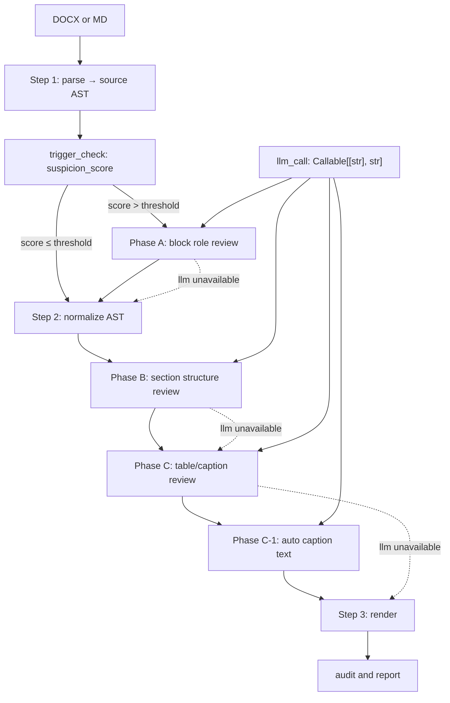

# LLM Enhancer 设计方案

## 目标

新增 `scripts/llm_enhancer.py`，把现有 `list_semantic_enhancer.py` 扩展为统一的 LLM 语义增强层。模块保持纯函数接口，唯一外部依赖为 `llm_call: Callable[[str], str]`。LLM 不可用、返回非法 JSON、置信度不足时，输出保持纯规则结果。

## 架构



## 模块边界

`llm_enhancer.py` 只处理 AST decision patch，不直接操作 Word 对象。提供的函数：

```python
def enhance_document_model(model: dict, report: dict, *, phase: str, llm_call=None, hint=None) -> dict
def build_role_overrides_from_docx(src_doc, strict_normalize: bool, *, llm_call=None) -> dict[int, str]
def extract_json_object(raw: str) -> dict | None
def validate_patch(patch: dict, model: dict, allowed_ops: set[str]) -> list[dict]
def apply_patch_to_model(model: dict, patch: dict, report: dict) -> dict
def compute_suspicion_score(report: dict) -> float
def should_enhance(report: dict, phase: str, mode: str) -> bool
```

旧 `list_semantic_enhancer.py` 保留兼容导入，内部转调 `llm_enhancer.build_role_overrides_from_docx`。

## Patch Schema

LLM 只返回 JSON 对象：

```json
{
  "schema_version": "1.0",
  "phase": "A",
  "decisions": [
    {
      "block_id": "b0007",
      "operation": "retype",
      "from": {"block_type": "body"},
      "to": {"block_type": "list_item", "level": 0, "list_type": "lower_letter_paren"},
      "confidence": 0.82,
      "reason": "consecutive_functional_points"
    }
  ]
}
```

应用约束：

1. 只允许修改现有 block，不新增正文段落。
2. `block_id` 必须存在。
3. `confidence < 0.70` 不应用，只写入 report。
4. Phase A 禁止改表格内容。
5. Phase B 允许标题层级和列表重启修正。
6. Phase C 允许 `table_type`、`header_rows`、`caption_type`、题注文本修正。
7. 所有变更写入 `report["llm_enhancer"]`。

## Phase A: 段落角色增强

**位置**：Step 1 之后、Step 2 之前。

**输入**：source AST，按标题 section 分组，每组包含前后标题、段落文本、原始样式、规则推断 role、编号信息。

**输出**：局部 retype，覆盖范围为 `heading/body/list_item/caption`。

**Prompt 要点**：

```text
你是文档结构审查器。请根据上下文判断段落角色。
只返回 JSON 对象。
禁止新增、删除、合并段落。
优先保留规则判断。
仅在上下文强烈支持时修改。
允许角色: heading, body, list_item, caption。
列表统一为 level=0, list_type=lower_letter_paren。
标题层级必须在 1 到 6。
```

**解决问题**：

1. 封面元信息误判标题。
2. 无样式标题漏识别。
3. 正文以 `a)` 开头造成列表误判。
4. 无标记功能点列表识别。

## Phase B: 章节结构增强

**位置**：Step 2（规范化）之后。

**输入**：Phase A 后的 AST 摘要，包含所有标题、每个 section 的块计数、疑似层级跳跃、短标题候选。

**输出**：标题层级修正、正文到标题提升、标题降级为 body、列表 restart 修正。

**Prompt 要点**：

```text
你是技术文件目录结构审查器。
请检查标题层级是否连贯。
输出 JSON patch。
不要根据文字好坏改写内容。
不要创建新标题。
如果封面、日期、版本、目录文字被识别为标题，应降级为 body。
```

**解决问题**：

1. Heading 2 起步导致层级整体偏移。
2. 视觉标题全部被设为 Heading 2。
3. 封面元信息进入目录。
4. 每章节列表重启判断错位。

## Phase C: 表格和题注增强

**位置**：Phase B 之后。

**输入**：表格摘要——不发送全量大表，只发送行列数、前 3 行文本、单元格数量、相邻前后 block、已有题注候选。

**输出**：`table_type`、`header_rows`、`caption_type`、题注块 retype。

**Prompt 要点**：

```text
你是技术文件表格语义审查器。
判断表格类型: data, code_sample, layout, unknown。
API 示例表通常是单格 JSON, HTTP, XML, Plain Text。
layout 表通常用于排版，不应自动插入表题注。
data 表通常有表头，header_rows 通常为 1。
只返回 JSON 对象。
```

**解决问题**：

1. 数据表、布局表、API 示例表区分。
2. `[图表]` 以外的题注识别。
3. API 示例表避免自动题注。
4. code sample 表格 `header_rows=0`。

### Phase C-1: 题注文字自动生成

**场景**：表格或图片无题注、或已有 `_auto_generated` 空题注（当前 `model_normalization.py` 行为）——结合上下文和表格/图片内容，用 LLM 生成合适的题注描述文字。

**输入**：
- 表格：前 3 行文本（含表头）、列数×行数、相邻前后 block 的文本（前后各一段正文或前一个 heading）
- 图片：alt text、相邻前后 block 的文本
- 当前章节的前一个 heading 文本（作为语境线索）

**输出**：简洁的题注文字（≤30 字），写入空题注 block 的 `text` 字段。

**Prompt 要点**：

```text
你为技术文档的表格/图片撰写题注说明。
题注要求简洁、准确，不超过 30 字。
根据表格内容和上下文描述"这个表格/图展示了什么"。
不要重复"表"/"图"前缀（框架会自动添加）。
如果信息不足无法判断，返回空字符串。
只返回 JSON: {"caption_text": "..."}。
```

**约束**：
- 只对 `_auto_generated` 标记的空题注生成文字，已有文字的不覆盖
- layout 表、API 示例表不生成题注
- 图片无 alt text 且上下文信息不足时，返回空字符串
- 图片有 alt text 时优先基于 alt text 生成

**与现有流程的集成**：

在 `model_normalization.py` 的 `normalize_document_model_simple()` 中，已有逻辑在第 178-202 行为无题注表格插入空 caption block。Phase C-1 在此之后运行，将空 caption 的 `text` 填充为 LLM 生成的内容：

```diff
# model_normalization.py — normalize_document_model_simple() 末尾
     for bi in reversed(insert_indexes):
         ...
         new_caption["_auto_generated"] = True
         blocks.insert(bi + 1, new_caption)
+
+    # Phase C-1: LLM-generated caption text for auto-inserted captions
+    if llm_call:
+        _fill_auto_captions(model, report, llm_call)
```

---

## 触发策略

### 运行模式

新增 CLI 参数 `--llm-enhance`，替代二进制环境变量：

```bash
--llm-enhance off     # 不启用（默认）
--llm-enhance auto    # 自动判断：suspicion_score ≥ 阈值时触发
--llm-enhance a       # 强制 Phase A
--llm-enhance ab      # 强制 Phase A + B
--llm-enhance abc     # 强制全部 Phase（等价于旧 WX_DOC_LLM_ENHANCE=1）
--llm-enhance force-a # 强制 Phase A，忽略 suspicion 检查
```

环境变量 `WX_DOC_LLM_ENHANCE=1` 继续兼容，映射为 `abc`。

### 智能触发：suspicion_score

`compute_suspicion_score(report)` 基于 Step 1 解析报告计算一个 0-1 的"可疑度"分数。达到阈值时才触发 LLM 增强。

**评分因子**：

| 信号 | 来源 | 权重 | 说明 |
|------|------|------|------|
| `suspect_visual_headings` 数量 | parse_report | 0.25 | 视觉标题嫌疑段数/总段落 |
| `ambiguous_short_paragraphs` 数量 | parse_report | 0.20 | 短段落歧义段数/总段落 |
| `inferred_headings` 数量 | parse_report | 0.15 | 从文本推断的标题数/总标题 |
| `inferred_lists` 数量 | parse_report | 0.10 | 从文本推断的列表数/总列表 |
| 无样式段落占比 | 源文档 | 0.15 | 没有 Heading/List 样式的段落比例 |
| 表格密度 | 源文档 | 0.10 | 表格数/总段落数 |
| 图片密度 | 源文档 | 0.05 | 图片数/总段落数 |

**阈值**：`suspicion_score ≥ 0.15` 时触发 `auto` 模式。

**示例**：
- 一个标准 Word 文档（全用 Heading 样式、无歧义段落）→ score ≈ 0.05，跳过
- 一个纯文本粘贴文档（无样式、大量短段落）→ score ≈ 0.40，触发
- 一个排版混乱的 PDF 导出文档 → score ≈ 0.60，触发

### Phase A 修改率反馈

Phase A 完成后统计 LLM 修改率：

- **修改率 < 5%**：规则判断已经足够好，自动跳过 Phase B 和 C
- **修改率 ≥ 5%**：说明源文档结构确实有问题，继续 Phase B/C

这个逻辑只在 `auto` 模式下生效，手动模式（`a`/`ab`/`abc`）不跳过。

### 自行跳过信号

以下情况 LLM 增强自动跳过（即使 mode=auto 且 score 达标）：

- 文档 block 数 < 5（太短，规则足够）
- 源文档 100% 使用标准 Heading 样式（标题无需推断）
- `template_profile` 缺失（无模板的预览模式）
- `llm_call is None`（无 LLM 后端）

### Reason 枚举

LLM 返回的 `reason` 字段使用标准化枚举，用于 report 统计和后续分析：

```
reason 枚举值：
  consecutive_functional_points  连续功能点短句 → 列表
  isolated_short_body            孤立的短正文 → 列表/标题
  cover_metadata                 封面/版本/日期信息 → body
  numbered_but_not_heading       有编号但不是标题 → 取消标题
  visual_format_suggests_heading 加粗/大字号暗示标题 → 提升为标题
  section_continuity             章节层级连续性 → 层级调整
  layout_table                   排版用途表格 → layout
  api_example_table              API 示例表 → 不套用表正文
  data_table_headers             数据表表头 → header_rows=1
  nonstandard_caption            非标准题注格式 → 题注识别
  caption_text_generated         自动生成题注文字
```

---

## 手动提示词

### --llm-hint 参数

用户可通过自然语言指令引导 LLM 增强行为：

```bash
python3 -m main --input doc.docx --output out.docx --template t.docx \
  --llm-enhance abc \
  --llm-hint "功能列表要识别完整；图片题注根据上下文生成；不要改动正文内容"
```

### Hint 注入规则

1. hint 被分类到对应的 Phase（通过关键词匹配）+ 兜底注入到所有 Phase
2. 分类关键词：
   - Phase A: 列表、段落、角色、标题、正文、封面
   - Phase B: 目录、层级、结构、章节、编号
   - Phase C: 表格、题注、图片、图表、类型
3. 注入方式：在各 Phase prompt 末尾追加 `用户特别提示：{hint}`
4. hint 内容记录到 `report["llm_enhancer"]["user_hint"]`

### 自动建议（suggestions）

LLM 增强分析完成后，可以在 report 中输出建议：

```json
{
  "llm_enhancer": {
    "suggestions": [
      {
        "severity": "info",
        "message": "检测到 8 个功能点列表未识别，建议开启 Phase A",
        "action": "--llm-enhance a"
      },
      {
        "severity": "warning",
        "message": "封面元信息「版本: V2.1」「日期: 2024-06」可能被误判为标题",
        "action": "--llm-enhance b"
      }
    ]
  }
}
```

这样用户在 `off` 模式下也能看到"如果不满意可以试试增强模式"的提示。

---

## 效率优化

### 批量策略

| Phase | 批处理方式 | 调用次数 | 预估 token/次 |
|-------|-----------|---------|--------------|
| A | 整篇文档一次性发送（按 section 分组） | 1 | 2K-8K |
| B | 标题和 section 摘要一次性发送 | 1 | 1K-3K |
| C | 全部表格摘要一次性发送 | 1 | 1K-5K |
| C-1 | 与 C 合并为一次调用（不需要单独 round-trip）| 0（合并到 C） | — |

**最优路径**：总计 2 次 LLM 调用（A + B+C合并），即使在 `abc` 模式下也只 2 次 round-trip。

### Token 预算控制

- **段落截断**：每个段落 text 最多 200 字符
- **表格摘要**：只传前 3 行 + 列数×行数，不传全量数据
- **section 聚合**：超过 30 个 section 时分批（每批 20 个，最多 2 批）
- **总预算**：单次调用 prompt ≤ 12K tokens，超限时采样（优先保留歧义高的 section）

### 缓存策略

```text
.wx-doc-format-cache/llm/
├── {input_md5}_phase_a.json    # Phase A 结果缓存
├── {input_md5}_phase_b.json    # Phase B 结果缓存
└── {input_md5}_phase_c.json    # Phase C 结果缓存
```

- 缓存键 = `hash(input_path + template_path + version + hint)`
- 同一文档重新转换时直接从缓存读取，跳过 LLM 调用
- 源文档修改后（hash 变化）自动失效
- `--no-cache` 参数强制跳过缓存

### 并行和串行边界

```
Phase A ──(串行依赖)──> Phase B+C（合并）
```

- Phase A 必须在 Step 2 规范化之前完成（它影响 AST 结构）
- Phase B、C、C-1 在规范化之后，可以合并为一次批量调用
- Phase A 和 B/C 之间不能并行（Phase A 的输出影响 Phase B 的输入）

### 模型分层策略

根据 Phase 复杂度选择不同模型：

| Phase | 模型层 | 推荐模型 | 原因 |
|-------|--------|---------|------|
| A | 强模型 | deepseek-v4 / gpt-4o / claude-sonnet-4 | 需要全文语义理解，复杂判断 |
| B+C | 快模型 | deepseek-v4-flash / gpt-4o-mini / claude-haiku | 结构化摘要判断，token 量小 |

通过 `auto_llm_call` 中的模型选择逻辑：
- `LLM_MODEL_PHASE_A` 环境变量控制 Phase A 使用的模型
- `LLM_MODEL_PHASE_BC` 环境变量控制 Phase B/C 使用的模型
- 未设置时使用 `LLM_MODEL` 或自动探测的默认值

### 超时和 Early Abort

- 单次 LLM 调用超时：30 秒
- 超时后该 Phase 静默跳过，已有 patch 不应用
- Phase A 失败 → Phase B/C 不执行（但 Step 2 仍然继续用纯规则）

### 增量增强：仅对低置信 block 送 LLM

Phase A 不完全扫描所有 section。只送 `suspicion_score` 高的候选 section：

- 包含 `ambiguous_short_paragraphs` 的 section → 高优先级
- 包含 `suspect_visual_headings` 的 section → 高优先级
- 纯 Heading 样式 + 纯 body 的 section → 跳过（规则结果可信）

这使 Phase A 的 input 量减少 30-70%（取决于文档复杂度），同时保持精度。

---

## main.py 集成方案

现有逻辑在 `convert_docx()` 中先生成 `source_model`，再 `normalize_document_model()`，随后只给 `render_docx_direct()` 传 `role_overrides`。增强移到 AST 层，并继续保留直渲染兼容覆盖。

```diff
-from model_normalization import normalize_document_model, summarize_source_document_model
+from model_normalization import normalize_document_model, summarize_source_document_model
+from llm_enhancer import (
+    enhance_document_model,
+    build_role_overrides_from_docx,
+    auto_llm_call,
+    compute_suspicion_score,
+    should_enhance,
+)

-def convert_docx(...):
+def convert_docx(...):
     src_doc = Document(src)
     source_model = parse_docx_to_model(...)
     summarize_source_document_model(report, source_model)
+
+    # Determine LLM enhancement mode
+    enhance_mode = _resolve_enhance_mode(args)
+    llm_call = auto_llm_call(enhance_mode) if enhance_mode != "off" else None
+
+    # Phase A: block role review (before normalization)
+    if should_enhance(report, "A", enhance_mode):
+        source_model = enhance_document_model(
+            source_model, report, phase="A", llm_call=llm_call,
+            hint=args.llm_hint,
+        )
+
     model = normalize_document_model(source_model, report)
-    role_overrides = None
-    import os as _os
-    if _os.environ.get("WX_DOC_LLM_ENHANCE") == "1":
-        try:
-            from list_semantic_enhancer import build_role_overrides_from_docx
-            ...  # 旧逻辑删除
+
+    # Phase B + C: structure and table enhancement (after normalization)
+    if should_enhance(report, "B", enhance_mode):
+        model = enhance_document_model(
+            model, report, phase="B", llm_call=llm_call,
+            hint=args.llm_hint,
+        )
+    if should_enhance(report, "C", enhance_mode):
+        model = enhance_document_model(
+            model, report, phase="C", llm_call=llm_call,
+            hint=args.llm_hint,
+        )
+
+    role_overrides = build_role_overrides_from_docx(
+        src_doc, strict_normalize, llm_call=llm_call
+    ) if llm_call else None
```

CLI 参数：

```diff
+parser.add_argument(
+    "--llm-enhance",
+    choices=["off", "auto", "a", "ab", "abc", "force-a", "force-ab", "force-abc"],
+    default="off",
+    help="LLM semantic enhancement level (default: off)"
+)
+parser.add_argument(
+    "--llm-hint",
+    type=str,
+    default=None,
+    help="Natural-language hint injected into LLM enhancement prompts"
+)
```

---

## 错误处理和降级

1. `llm_call is None`：直接返回原 model。
2. LLM 调用异常：捕获并写入 `report["llm_enhancer"]["errors"]`。
3. JSON 解析失败：记录 raw 片段前 500 字符。
4. schema 校验失败：整批 patch 丢弃。
5. 单条 decision 不合法：丢弃该条，保留其他合法条。
6. 低置信度：不应用，写入 skipped。
7. 应用后跑 `validate_document_model()`，失败则回滚该 phase。
8. LLM 调用超时（30s）：该 Phase 静默跳过。
9. 所有 phase 都必须保证 `unexpected_styles` 不受影响。

---

## 测试方案

### 单元测试

1. `test_llm_enhancer_no_llm_returns_original_model`
2. `test_llm_enhancer_extracts_json_object_from_wrapped_text`
3. `test_phase_a_body_to_list_retype`
4. `test_phase_a_rejects_unknown_block_id`
5. `test_phase_b_demotes_cover_metadata_heading`
6. `test_phase_c_marks_api_example_table_without_caption`
7. `test_phase_c_generates_caption_text_for_empty_auto_caption`
8. `test_phase_c_skips_caption_gen_for_layout_table`
9. `test_phase_c_skips_caption_gen_when_text_already_exists`
10. `test_low_confidence_patch_is_skipped`
11. `test_invalid_patch_rolls_back_phase`
12. `test_suspicion_score_low_skips_enhancement`
13. `test_suspicion_score_high_triggers_enhancement`
14. `test_phase_a_low_modification_rate_skips_bc`
15. `test_llm_hint_injected_into_prompt`
16. `test_cache_hit_skips_llm_call`

### 集成测试

1. 构造 fake `llm_call`，跑 `convert_md()` 和 `convert_docx()`。
2. 断言 `report["llm_enhancer"]` 有 applied 和 skipped。
3. 断言规范化后 `validate_document_model()` 无新增错误。
4. 断言 API 示例表不会自动生成题注。
5. 断言列表仍按章节重启。
6. 断言无题注表格被赋予 LLM 生成的题注文字（非空）。
7. 断言 `auto` 模式下低 suspicion 文档跳过 LLM。
8. 断言缓存命中时不再调用 `llm_call`。

---

## 实现优先级

| 序号 | 任务 | 说明 |
|------|------|------|
| 1 | 新增 `llm_enhancer.py` | JSON 提取、schema 校验、patch 应用、report 记录 |
| 2 | 迁移 `list_semantic_enhancer.py` | 改为兼容包装，内部转调新模块 |
| 3 | 实现触发策略 | suspicion_score、should_enhance、auto 模式 |
| 4 | 接入 Phase A | 覆盖现有 body/list 能力，增加 heading/caption 修正 |
| 5 | 接入 Phase B | 处理标题层级和封面元信息 |
| 6 | 接入 Phase C + C-1 | 表格类型区分 + 自动题注生成（合并为一次 LLM 调用） |
| 7 | 效率优化 | 批量合并、token 预算、缓存、模型分层、超时 |
| 8 | 增加 CLI 参数 | `--llm-enhance` + `--llm-hint`，保留 `WX_DOC_LLM_ENHANCE=1` |
| 9 | 增加测试 | 单元测试 16 项 + 集成测试 8 项 |
